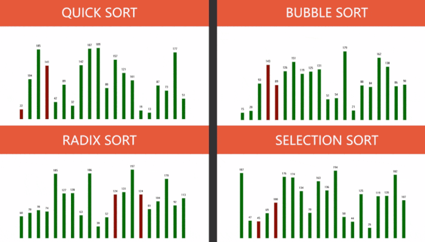

# SORT ALGORITHMS
- DATASTRUCTURE HOMEWORK
- MAIN CODE IN `Class-DesignDlg.h`&`Class-DesignDlg.cpp`

## DEVELOPMENT ENVIRONMENT
- OS NAME MICROSOFT WINDOWS 10 ENTERPRISE N
- TOTAL PHYSICAL MEMORY 15.9GB
- MICROSOFT VISUAL STUDIO COMMUNITY 2017

## REFERENCE
- QUICK_SORT, BUBBLE_SORT, INSERT_SORT, HEAP_SORT, SELECTION_SORT, MERGE_SORT, SHELL_SORT, RADIX_SORT [https://www.geeksforgeeks.org/sorting-algorithms/](https://www.geeksforgeeks.org/sorting-algorithms/)

## DEMO

